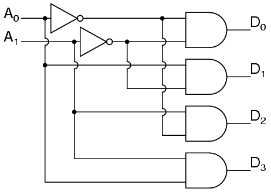

# Decoders

A circuit that changes a code into a set of signals and does the opposite job of an *encoder*. 

{width=50%}

You can turn an adder into a subtractor by inverting the inputs of second term
	- 2's compliment

