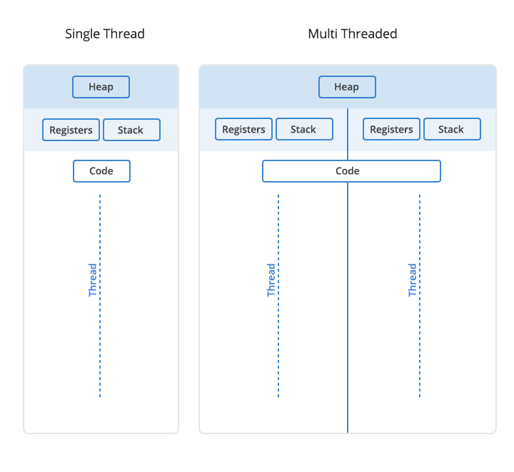

# Worksheet 7 : Parallel Processing

> Jared Dyreson

> CPSC-240 09 @ 11:30 - 13:20 (TR)

> May 2, 2019

1. Mutex: a mutual exclusion object is a program object that is created so that multiple program threads can take turns sharing the same resource, such as access to a file
2. Deadlock: a situation where two programs sharing the same resource are effectively preventing each other from accessing the resource, resulting in both programs to cease functionality
3. Race Condition: the system's substantive behavior is dependent on the sequence or timing of other uncontrollable events
4. Lock contention: a condition where one thread is waiting for lock/object that is currently being held by another thread. Therefore, this waiting thread cannot use that object until the other thread has unlocked that particular object
5. Moore's Law: the principle that the speed and capability of computers can be expected to double every two years, because of the increase of transistors on a given chip
6. Two approaches to parallel processing
	- Multiple processors working in tandem with each other to conquer a task
	- Lock and Unlocking processes through the use of mutexes and semaphores
7. All the threads will have their own stack as it would would possibly create a race condition and break program flow. However, all the threads share memory with the heap, as it is meant to be dynamically allocated.

{width=50%}

\pagebreak

8. The mutex/semaphore protect the current process running so another process does not interrupt it prematurely
9. Atomic Operation: program operations that run completely independently of any other processes
10. Since a thread will get its own set of general purpose registers, it is accessing them through the CPU cache which contains "second class" registers and are blazing fast. 

\pagebreak

# External Links

[How threads get their own registers](https://stackoverflow.com/questions/16718484/is-it-possible-to-share-a-register-between-threads)

