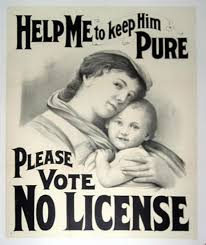

# Reform Over Revolution (The Progressive Age)

- Never got a hold of socialism

## Challenges Facing Americans in the Late 19th Century

- New wave of immigration - the Ellis Island generation
- Urbanization
- Labor unrest
- Jim Crow Laws
	- Laws that seek to oppress and smother Black rights
- Lack of franchise for women and African Americans
- Women played a large role in addressing (though not necessarily solving) many of these problems
	- Suffrage, prohibition
- Laissez Faire: hands-free mode, no regulations (**free market economy**)
	- Let it be by the Beatles

## Women in 1900

- Women's lives structured by race, class and marital status, in that order
- Average lifespan was 48.3 years
- Average women married at age of 22
- Women who reached adulthood had an average of 3.6 children

## Women's Rights in 1900

- A married woman had no separate legal identity from her husband
- No control over repoduction (even talking about contraception is illegal)
- No property held in her name
- Jobs available
	- No career but not going anywhere

## Middle Class White Women's Roles

- Middle class is overwhelmingly white, urban, Protestant, Anglo-Saxon
- Sacred duty - raise virtuous sons and daughters
- Victorian sexualality
	- Women were not allowed to be sexually active

## Change Already Underway in 1900

- Literacy - more girls than boys finished high school 
	- Boys got jobs before finishing
- New female-dominated professions
	- Nursing
	- Social work
	- Clerical jobs also becoming women's work
- College Education
	- Women constitute 30% of college students
- Professions limited

## Women and Temperance Movement

- Movement against alcohol

## Francis Willard

- WCTU: Women's Christian Temperance Union
- Refocused organization on social *action*
- Home protection outside of the home (political activism)

## Jane Addams

- Mother of social work
- Hull House
- Represented what is known as the "social gospel" reform tradition

## Johnny Powers and the Boodlers

- Powers was an Irish "boodler"
- A city boss targeted by Jane Addams
- Trash smells really bad
- Goes around and making sure the trashmen were doing their jobs

## What is Progressivism

- A political approach that dominated change in the United States from roughly 1900-1920
- Centered on the idea that America's political system is fundementally sound, but was in need of attention to perfect the relationship between government and society
- Not laissez-faire, but not intrusive

### How did Progressivism Work?

- An unofficial alliance between middle class reformers and presidents of two major parties who advocated the REFORM of problematic aspects of society through legislation
- Women were heavily represented among progressives
- Introduction of Liberals
- Speaking out against monopolies

{width=50%}

## The Muckrakers

- to characterize reform-minded American journalists who attacked established institutions and leaders as corrupt

## Florence Kelly 

- Chicago based crusader against child labor laws
- College educated
- Advocate against child labour

## Making Human Junk

- People who advocated for abolishing child labor laws claimed that it was affecting the education of the youth (cause guess what, it was)
- Others said it made them hard workers
	- But that is not entirely true

## How did Progressive Reach and Sway the Public

- McClure's magazine
	- Popularized progressive causes
	- Monthly and published books
	- Magazines were effective because they were in a language that everyone could understand, where as books may have used higher level thinking/big words
		- It was also cheaper

## Clara Lemlich and the Uprising of the 20,000

- In 1909, International Ladies' Garment Workers Union went on strike in NY
	- Arrested and beaten by police
	- Strikers cooperate across ethnic lines
	- Cooperated with other unions
	- Impressed a lot people in NY
	- Went beyond racial lines
	- Ellis Island Generation
		- Segregated societies between different races
	- The situation for most workers did not get better

## Triangle Shirtwaist Factory Fire

- Many victims were Jews (immigrant) and their daughters
- Not enough fire escape routes and most of the employees died
- 100 people were burned alive

## Progressive Presidents

- Theodore Roosevelt (1901-1909)
	- Food Regulation
		- Meat Inspection Act of 1906
			- TR uses Sinclair's *The Jungle* to force reforms
		- Pure Food and Drug Act of 1906
			- Clamps down on patent medicine (alcohol) and took coccaine out of Coca-Cola (why they call it Coke)
- William Howard Taft (1909-1913)
- Woodrow Wilson (1913-1920)
	- Imposed an income tax for the first time
	- Created the Federal Reserve System which was 12 banks to expand or contract the currency to manage the economy
	- Created Federal Trade Commission to Prevent monopolies
	- Granted women's suffrage hesitantly (what a cunt)

## The Election of 1912

- All three of the above run and also a Eugene Debs runs (who was not a progressive)
- Debs was basically was a communist (kicked out of America was considered a RED)

## Ida B. Wells

- Trained in Reconstruction-era schools
- Member of the black middle class
- Daughter of a "race man"
- Anti-lynching campaign
- Alpha Suffrage Club
- [Documentary](https://www.youtube.com/watch?v=62eH6TNP72E)

## Margret Sanger

- Considered a radical, even among the New Women at the turn of the century
- Coined the term birth control
- Emphasized "economic self-sufficiency" (a break from Progressive tradition)
- Woman Rebel: the newspaper led to Sanger's arrest
- Pamphlet "Family Limitation" written by Sanger and distributed by Wooblies
- Founder of Planned Parenthood

## Birth Control as "Race Suicide"

- Because he is a Conservative white male, who is Christian who can't wrap his pea-sized brain around the idea of an idea going against God

## Madame C.J Walker

- Earned her wealth by selling her hair products and skin lotion to primarily African American customers in Indianapolis between 1910 until her death in 1919

