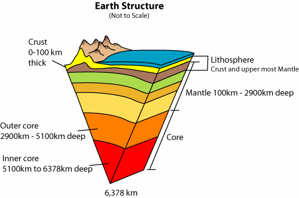
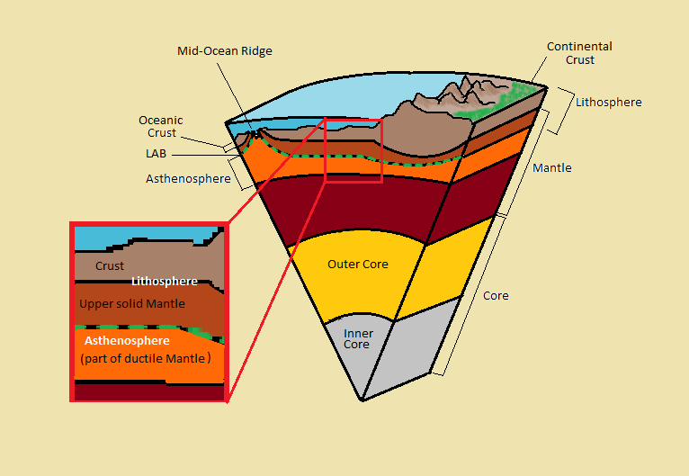
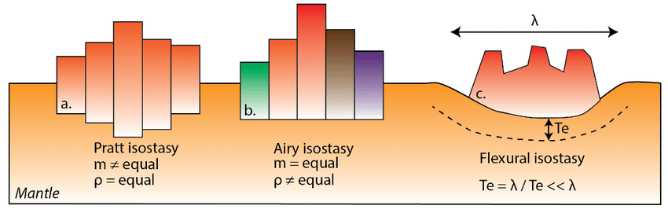
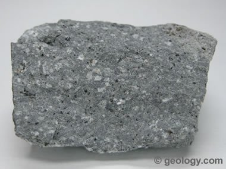
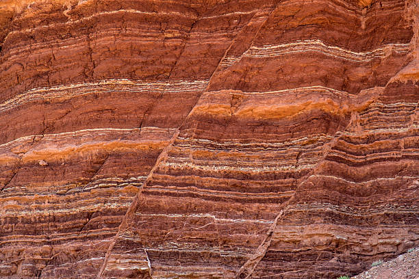
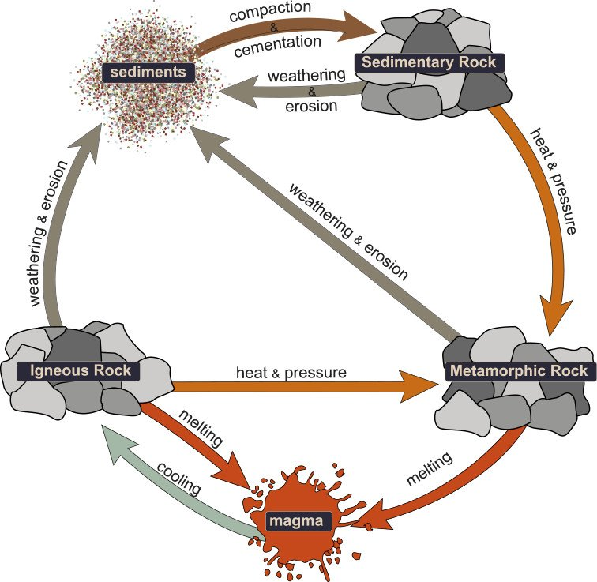

# nature of geology (chapter one)

- observational science
- there are a lot mountains on the West coast

## how does geology influence where we live

- we live within a 50 mile radius of a large water body
- transportation
- need water to survive
- food (fishing)
- 1/3 of the entire food for the country comes out of the Central Valley
- nature likes to build things up and tear them down

## what is inside earth

- upper layer is the crust (two types):
	- continental
	- oceanic
- thickest layer
	- mantle
- deepest layer:
	- iron-nickel core (molten outer core, solid inner core)

{width=50%}

## missing stuff

......

## some layers are stronger than others

- The top layer of the Earth is stronger than the middle.
- For example, a tootsie pop very dense on the outside and as you approach the center, it gets chewier.
- This external layer is called the lithosphere which contains (in order):
	- continental crust
	- oceanic crust
	- lithospheric mantle
- The inner layer is called the asthenosphere
	- it is hot, weak and mostly solid

- Hot things want to rise and lava rises because it is less dense
- Nature wants to erode things down or build things up

Mountains get more precipitation because they are higher in elevation
	- clouds get to the mountains first
	- one side gets water and the other side gets nothing
	- the wet side of the Andes allows for more life and the other side, Chile, its one of the driest places on earth

## why are some regions high in elevation

- areas that have a thick continental crust tend to be higher in elevation
- these areas also are thicker than the oceanic crust it neighbors
- Thick blocks are higher than the thinner blocks around them
- Thinner blocks are lower because they are more dense
- This relationship between crustal thickness and elevation: **isostasy**

### isostasy

Formal definition: 

 - the equilibrium that exists between parts of the earth's crust, which behaves as if it consists of blocks floating on the underlying mantle, rising if material (such as an ice cap) is removed and sinking if material is deposited.

{width=75%}

## earth's forces and how they help process it's materials

many different environmental factors help shape the Earth such as atmospheric pressure, gravity, etc

## steep mountain front

- steep and angular
- have not moved far
- rocks -> sand grains

## rock formation

- igneous rocks (fire rocks)

{width=50%}

These rocks form from magma and are expelled by volcanoes

- metamorphic rock (rocks that have change)

{width=50%}

These rocks can be found away from a volcano, more specifically rocks moved by nature. 
Sand is an example of this as grains of sand are actually microscopic balls of rock.

- sedimentary (rock layers)

{width=50%}

Layered slabs of rock where the bottom is older than the top.
This is the only rock to support fossils, other rocks would erode or destroy fossils.

### rock cycle

The process in which rocks change between states and types.

{width=60%}

# External Links

- [inside the earth](https://www.sciencelearn.org.nz/resources/337-inside-the-earth)

File path to lecture -> ../lectures/EG5e_ch01_Nature of Geology.pdf
